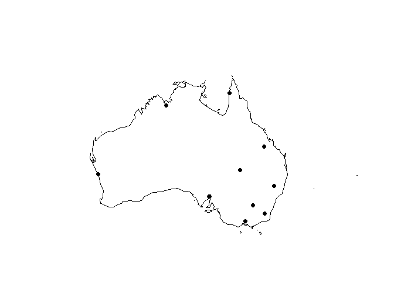

Toy Model of Weather: Australia
================

Set working directory as appropriate to read 'iata.csv' file.

The workflow of the R script is as follows:
1. Get location details of airports from the world from "<https://commondatastorage.googleapis.com/ckannet-storage/2012-07-09T214020/global_airports.csv>"
2. Clean the data and compute distance to coast of each airport in mainland Australia
3. Select random 10 airports
4. Create dummy climatic areas
5. Stochastic simulation of rainfall condition with a 3 state Markov chain model (sunny, cloudy, rain)
6. Calculate max & min temperature & humidity as function of latitude, elevation, distance from coast & season
7. Generate expected conditions for year: max, min temp & humidity, avg. daily pressure, condition
8. Report from 10 stations once daily at sunrise

Not done: for more frequent temperature & humidity values, impute from max & min values

Random 10 airport selected

``` r
#alter to appropriate filepath
iata <- read.csv("C:/Users/Pradeep Pillai/Desktop/weatherv1/testw/iata.csv") 
set.seed(123)
iata10 <- iata[sample(nrow(iata), 10), ]
iata10 <- iata[sample(nrow(iata), 10), ]
# check distribution of selected 10 airports
library(maps)
library(mapdata)
map('worldHires',
    'Australia',
    ylim = c(-40, -5),
    xlim = c(100, 170))
points(iata10$longitude, iata10$latitude,pch=16)
```



Stochastic simulation of daily climate First order 3 state Markov chain - Transition probabilites assumed to homogenous by region within season
- Because spatial correlation patterns of rainfall events may change monthly and seasonally (e.g., from a convective rainfall season to a frontal rainfall season), therefore, multiple probability matrices have been used.

Australia has six climatic zones and this translates as two main seasonal patterns. There is a Summer / Autumn / Winter / Spring pattern in the Temperate zone, also affecting the Desert and the Grassland climatic zones and, a Wet / Dry pattern in the tropical north which includes the Equatorial, Tropical and sub-tropical zones. Reference: <http://www.australia.gov.au/about-australia/australian-story/austn-weather-and-the-seasons>

More detailed climate zone classifications at:
Peel, M.C., Finlayson, B. L., and McMahon, T. A.: Updated world map of the Köppen-Geiger climate classification, Hydrol. Earth Syst. Sci., 11, 1633-1644, <doi:10.5194/hess-11-1633-2007>, 2007.
Kottek, M., J. Grieser, C. Beck, B. Rudolf, and F. Rubel, 2006: World Map of the Köppen-Geiger climate classification updated. Meteorol. Z., 15, 259-263.DOI: 10.1127/0941-2948/2006/0130. <http://koeppen-geiger.vu-wien.ac.at/present.htm>

Atmospheric pressure:
As per Hadley's 3 cell model, strong solar heating leads to rising air near equator, air descends at ~30° latitude to form subtropical highs. semipermanent pressure cells over central australia in July and further south in January.
Reference: <http://www.atmo.ttu.edu/schroeder/ATMO_1300/Notes/chapter8.pdf>

Temperature & humidity:
Temperature may be affected by sunshine available in the season, latitude, altitude, aspect, sea proximity and temperature, ocean currents.
